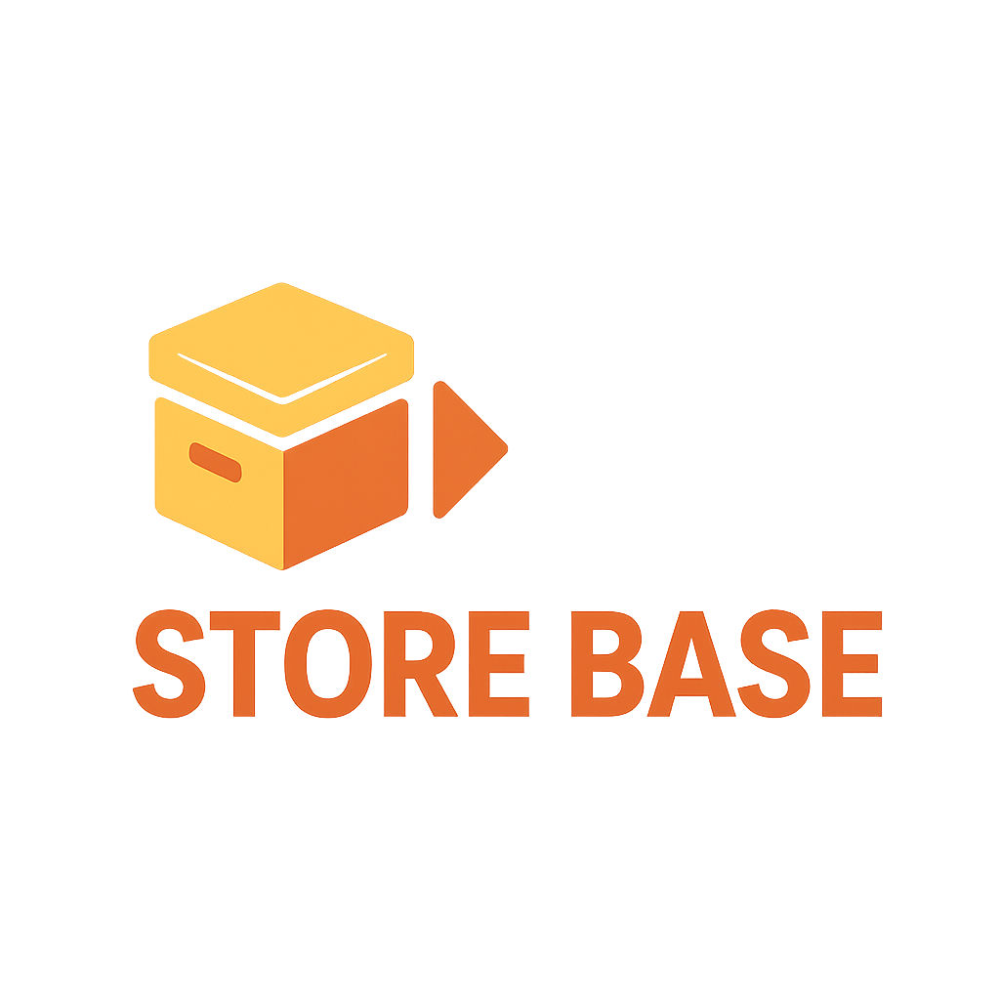
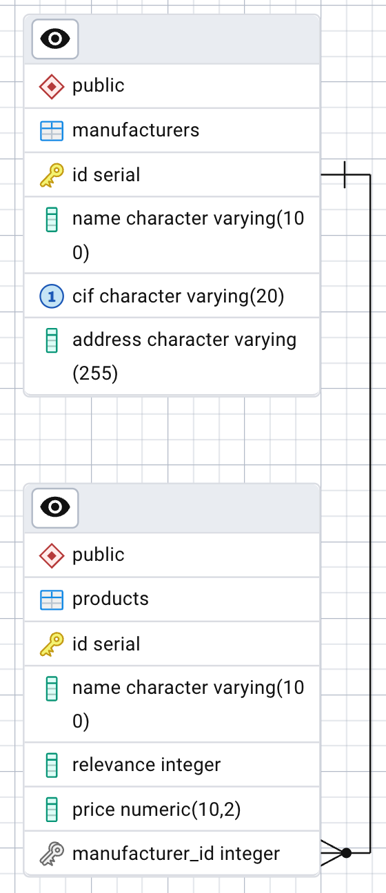
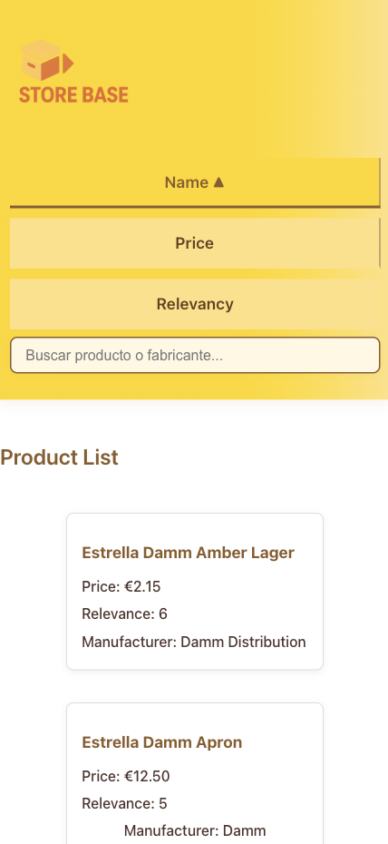
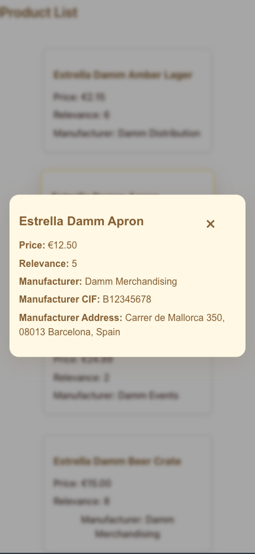
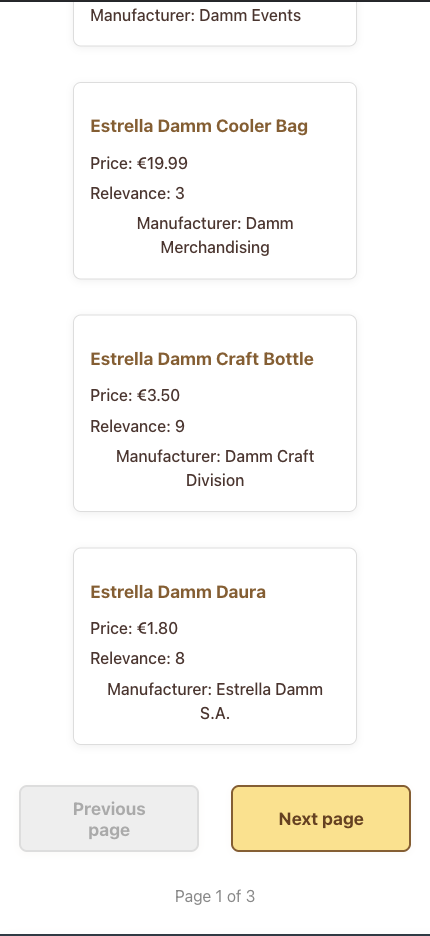
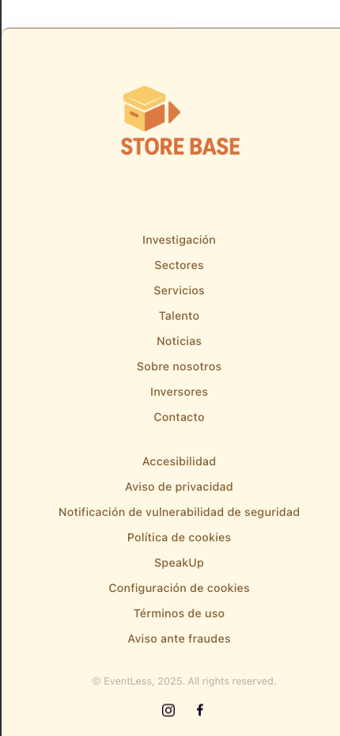
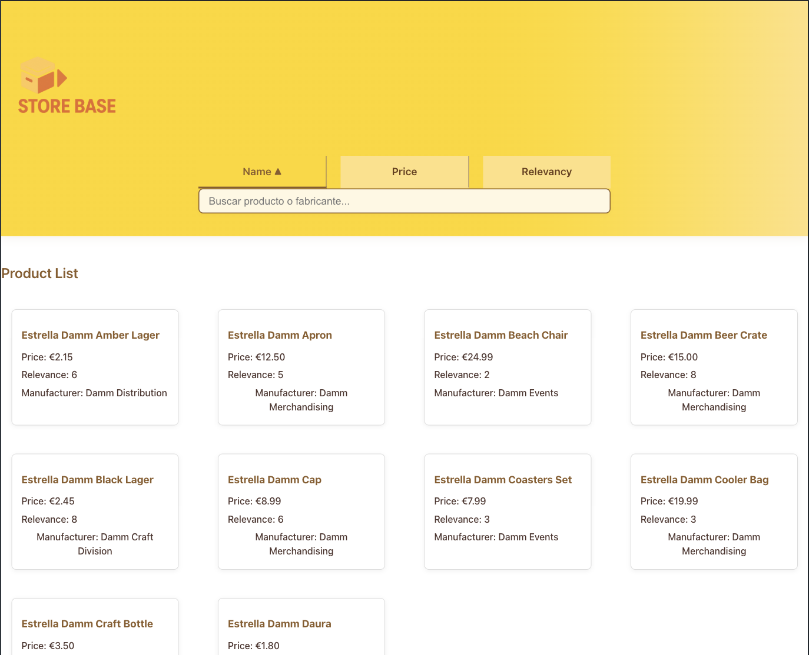
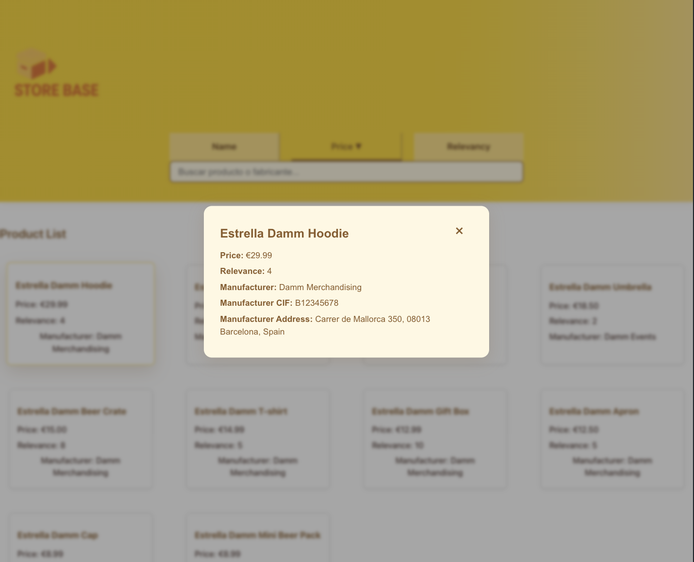
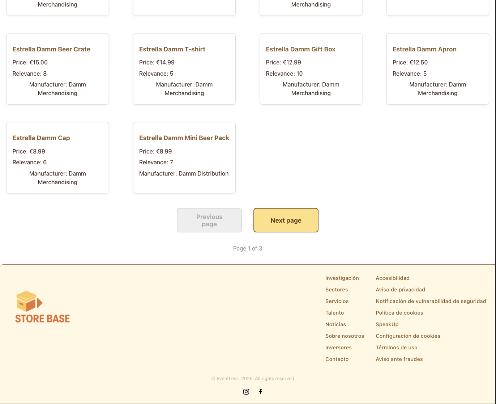
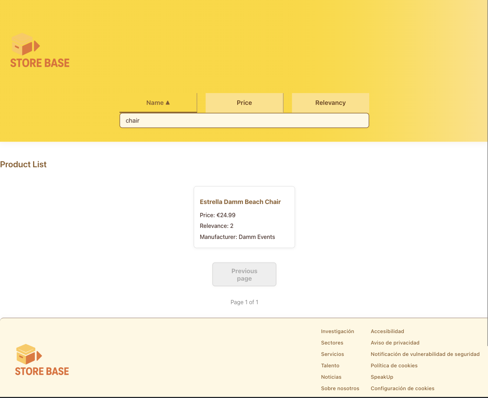

# 🛒 Store Base

## 🚀 Introduction
Store Base is a collaborative e-commerce platform developed as a fullstack project.  
It allows you to manage, search, and display products and manufacturers, with a modern and responsive interface.

- 🔹 Product and manufacturer management with search and filtering.
- 🔹 Sorting and pagination for easy navigation.
- 🔹 Deployed and ready for production on Render.

## 🎯 Purpose
Store Base focuses on providing a simple, scalable, and user-friendly solution for online product management.

- 📥 Centralized product and manufacturer data.
- 🧠 Smart search, sorting, and filtering.
- 📊 Real-time product listing and details.
- 📝 Responsive UI for desktop and mobile.

## 🧠 Main Features
✅ Product listing with sorting and pagination  
✅ Manufacturer management and search  
✅ Product detail view  
✅ Search and filter functionality  
✅ Responsive interface (React + SASS)  
✅ Ready for deployment on Render

## 🛠️ Technologies Used

| Layer      | Technology                |
|------------|--------------------------|
| Frontend   | React (SPA, mobile-first) + SASS |
| Backend    | Node.js + Express        |
| Database   | PostgreSQL (hosted on Render) |
| Infra      | Render                   |

## 📂 Project Structure

```
Store_Base/
├── app.js                  # Express backend entry point
├── config/                 # Database configuration
│   └── db.js
├── controllers/            # Backend controllers
│   ├── manufacturerController.js
│   ├── productController.js
├── models/                 # Data models
│   ├── manufacturerModels.js
│   ├── productModels.js
├── routes/                 # API routes
│   ├── manufacturerRoutes.js
│   ├── productRoutes.js
├── utils/                  # Utility functions and queries
│   └── queries.js
├── client/                 # React frontend
│   ├── public/
│   │   └── logoSB.png
│   ├── src/
│   │   ├── assets/
│   │   │   └── images/
│   │   │       ├── Facebook-1.webp
│   │   │       ├── Instagram.webp
│   │   │       └── logoSB.png
│   │   ├── components/
│   │   │   ├── Header/
│   │   │   │   ├── Header.jsx
│   │   │   │   ├── OrderButton/
│   │   │   │   │   └── OrderButton.jsx
│   │   │   ├── Main/
│   │   │   │   ├── Main.jsx
│   │   │   │   ├── ProductList/
│   │   │   │   │   └── ProductList.jsx
│   │   │   │   ├── ProductDetail/
│   │   │   │   │   ├── ProductDetail.jsx
│   │   │   │   │   └── ProductDetailModal.jsx
│   │   │   │   └── ManufacturerList/
│   │   │   │       └── ManufacturerList.jsx
│   │   ├── styles/
│   │   │   ├── components/
│   │   │   │   ├── _Header.scss
│   │   │   │   ├── _ProductCard.scss
│   │   │   │   ├── _Main.scss
│   │   │   └── views/
│   │   │       └── _App.scss
│   │   ├── App.jsx
│   │   └── main.jsx
│   ├── dist/               # Production build (if present)
│   └── package.json
├── package.json            # Backend package.json
└── README.md
```

## Project Architecture



## Screenshots











## 🌐 API Routes

### **Product Routes**
- `GET /api/products` — Get paginated list of products
- `GET /api/products/:id` — Get product details by ID
- `GET /api/products/search` — Search products by name or manufacturer

### **Manufacturer Routes**
- `GET /api/manufacturers` — Get paginated list of manufacturers
- `GET /api/manufacturers/:id` — Get manufacturer details by ID
- `GET /api/manufacturers/search` — Search manufacturers by name


## ⚙️ Installation & Local Usage

1️⃣ Clone the repository:
```sh
git clone https://github.com/fernanbga/Store_Base.git
```

2️⃣ Install backend dependencies and start backend:
```sh
npm install
npm start
```

3️⃣ Install frontend dependencies and start frontend (in `/client`):
```sh
cd client
npm install
npm run dev
```

4️⃣ Open the app:
- Frontend: [http://localhost:5173](http://localhost:5173)
- Backend/API: [http://localhost:3000](http://localhost:3000)

## 🐳 Deployment on Render

- The project is containerized with a multi-stage Dockerfile at the repo root.
- Deployed on Render as a Docker Web Service (Dockerfile-based).

## 📊 Roadmap

- Product and manufacturer CRUD
- Advanced search and filtering
- Dashboard with metrics
- PDF export for reports
- User authentication (future)

## 🌐 Live Demo

Visit the live app:  
[https://store-base.onrender.com](https://store-base.onrender.com)

## 🤝 Credits

Developed by @fernanbga